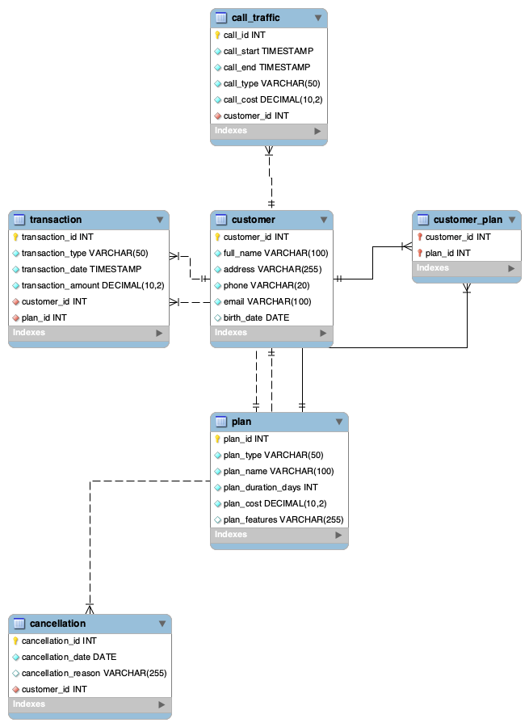

# MyMobile Telecom Database Project

   

A relational database project simulating a telecom provider’s operations.
Built in MySQL, the database manages customers, service plans, transactions, call traffic, and cancellations. Includes schema creation, sample data seeding, and business queries; all tested in a Docker environment with analysis in Jupyter Notebook.

## Introduction

This project is a complete database implementation for *MyMobile*, a fictional telecom provider. The relational schema, built in MySQL, is designed to efficiently manage all core business operations, including:

- **Customer profiles** and contact information
- **Service plans** prepaid, postpaid, data-only
- **Financial transactions** like activations, payments, and renewals
- **Call traffic** logs with duration, type, and cost
- **Customer-to-plan relationships** and cancellation records

## Key Features

- **Relational Database Design**: MySQL schema with primary keys, foreign keys, and relationships between customers, plans, transactions, calls, and cancellations.
- **Sample Data Seeding**:
SQL scripts to populate the database with realistic customers, plans, transactions, and call logs.
- **Business Queries / Reports**
  - Customer Summary: Plans and cancellations per customer
  - Customer Call Log: Call date, duration, type, and cost
  - Plan Revenue Report: Total revenue generated per plan
- **Analysis in Jupyter**
Python + Pandas + SQLAlchemy used to run queries and visualize outputs from the live MySQL database.
- **Automated Setup**
Docker Compose for fast, reproducible database deployment.

## Tech Stack

- **Database**: MySQL
- **Tools: Python, SQLAlchemy, Pandas, Jupyter Notebook**
- **Environment**: Docker

## Getting Started

### Prerequisites

  You must have [Docker Desktop](https://www.docker.com/products/docker-desktop/) installed and running on your system.

### Installation & Setup

#### 1. Clone the repository

```bash
  git clone https://github.com/Saavesh/sql-customer-database.git
  cd sql-customer-database
```

#### 2. Launch Docker

Run the following command from the root of the project directory. This will start the MySQL container. Then apply the schema and seed data using the SQL files in sql/.

#### 3. Start MySQL, apply schema and seed data

```bash
docker compose up -d
docker compose exec -T mysql mysql -uapp -papp_pw mymobile < sql/01_schema.sql
docker compose exec -T mysql mysql -uapp -papp_pw mymobile < sql/02_seed.sql
```

#### 4. Open the Jupyter Notebook (telecom_analysis.ipynb) to review detailed queries and reports

## Database Design

  

## Acknowledgments

This project is based on the MyMobile Telecom case study from the University of Colorado Boulder (CSPB 3287 – Database Systems).
All schema, scripts, and analysis were independently implemented and are my original work.
